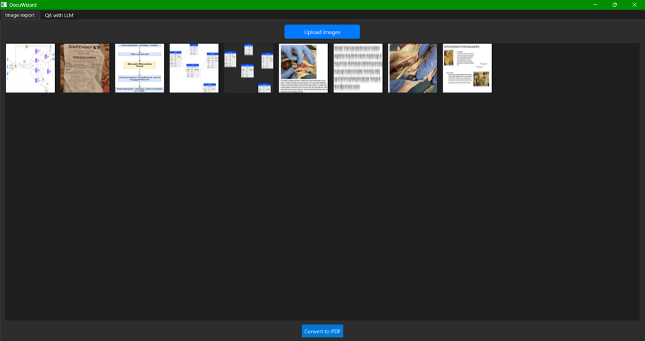
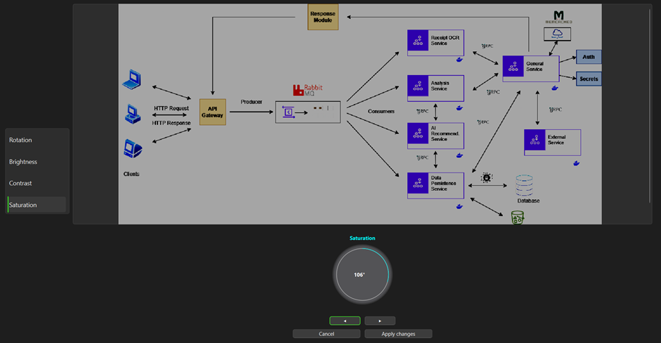
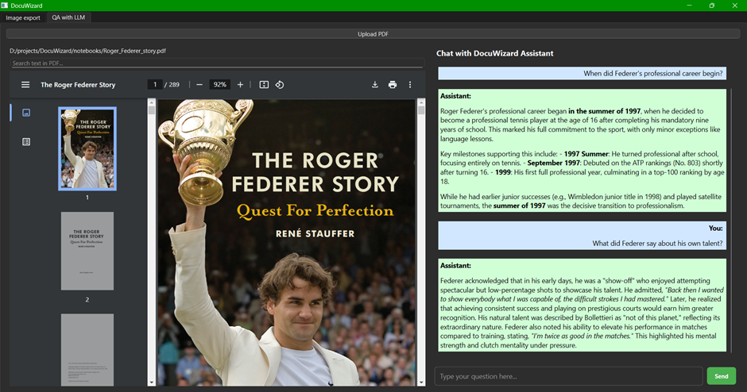

# DocuWizard

A modular desktop application built with PySide6 for document interaction, PDF conversion, and structured information retrieval. Designed for local workflows with a focus on usability, maintainability, and extendability.

   

   



---

## Features

- **Chat interface** for querying document content
- **Local image-to-PDF converter** with a minimal image editor
- **Retrieval-based QA** using vector search and LLM routing
- **Simple, modular architecture** for quick extension and experimentation

---

## Directory Structure
```bash
.
└── docuwizard/
    ├── app/
    │   ├── image_export/
    │   │   ├── __init__.py
    │   │   ├── styles.py
    │   │   └── utils.py
    │   └── rag/
    │       ├── __init__.py
    │       ├── embedder.py
    │       ├── llm_client.py
    │       ├── llm_router.py
    │       ├── preprocessor.py
    │       ├── prompt_type.py
    │       ├── utils.py
    │       └── vector_store.py
    ├── views/
    │   ├── doc_qa.py
    │   └── image_converter.py
    ├── main_window.py
    ├── main.py
    ├── __init__.py
    ├── notebooks/
    │   └── pdf_text_qa.ipynb
    ├── .gitignore
    ├── pdm.lock
    ├── pyproject.toml
    └── README.md
```

## Development

This project uses [PDM](https://pdm.fming.dev) for Python package management.

```bash
# Install dependencies
pdm install
```

```bash
# Run the application inside the main directory
pdm run python -m app.main
```

Python 3.11+ is recommended.

## Notes
- Environment variables (e.g., API keys) are expected in a `.env` file.

- `.env` is excluded from version control.